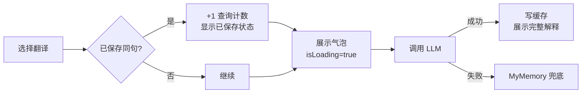
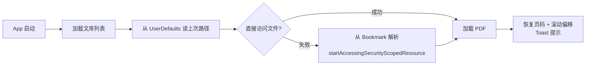

# LumenPDF — 产品需求文档 (PRD)

**版本**: v1.1 · **日期**: 2026-03-22

---

## 1. 产品定位

为深度学习者设计的 macOS 智能 PDF 阅读工具。像系统预览一样流畅，但支持**上下文感知翻译**、**原生高亮/划线标注**和**知识永久沉淀**。

---

## 2. 核心痛点

| 痛点         | 现有工具的问题                                              |
| ------------ | ----------------------------------------------------------- |
| 翻译没有语境 | 只给词典释义，无法解释"为什么在这句话里是这个意思"          |
| 查完即忘     | 无法便捷保存词汇 + 句子 + 解释三元组，也无法在 PDF 留下痕迹 |
| 同词异境混淆 | 相同单词在不同语境应有不同翻译，但普通工具只给同一释义      |
| 选词不准确   | pdf.js 方案坐标计算误差大，严重影响体验                     |

---

## 3. 功能需求（当前版本 v1.1）

### F1 — PDF 阅读

- **文库管理**：通过工具栏「文库」按钮打开 Popover，展示所有曾打开的 PDF（按最近打开倒序），每条显示文件名与阅读进度（P32/118）。支持文件选择器打开；支持从文库移除（不删磁盘文件）。
- **阅读位置恢复**：关闭 / 切换 / App 后台时自动保存当前页码和页内滚动偏移；重新打开时自动跳转，并用 Toast 提示"已定位到 P32"。重启 App 后通过 Security-Scoped Bookmark 自动重新授权访问上次文件。
- **PDF 渲染**：基于 PDFKit，支持缩放（autoScales）、连续纵向滚动（singlePageContinuous）；已保存词汇显示黄色高亮 Annotation，重启后自动恢复。
- **PDF 目录（TOC）**：左侧栏展示文档大纲，随阅读位置高亮当前章节（ScrollViewReader 自动滚动到可见范围），点击条目跳转对应页面。

### F2 — 选词操作菜单（核心体验）

划选词汇或句子后，在选区上方弹出胶囊形操作菜单（位置贴近选区），提供三个操作：

| 操作     | 行为                                                                        |
| -------- | --------------------------------------------------------------------------- |
| **翻译** | 开启翻译气泡，调用后端翻译                                                  |
| **高亮** | 在 PDF 添加黄色高亮标注（Toggle：再次点击则移除；与现有高亮部分重叠则合并） |
| **划线** | 在 PDF 添加蓝色下划线标注（Toggle：再次点击则移除；部分重叠则合并）         |

选区清除时菜单自动消失。

### F3 — 智能划词翻译

划选词汇并选择「翻译」后提取所在**完整句子**（按 `.!?。！？` 定位边界，最长 2000 字符，精确使用选区的 `range(at:on:)` 字符坐标而非几何坐标），调用后端翻译，弹出可拖动气泡。

**翻译策略**（三级降级，始终从 LLM 开始，不复用旧缓存）：

```
始终调用 LLM → 成功则写缓存 → 失败则 MyMemory API 兜底
```

> **注意**：相同单词在不同语境（不同句子）会分别调用 LLM，获取针对该语境的独立翻译。句子 hash 用于判断是否已保存到单词本，而非复用翻译结果。

**气泡内容**：

- 标题区：单词（独行大字）、音标（次行）；兜底翻译显示「基础翻译」徽标
- 语境翻译、语境解释、通用释义
- 整句译文 + 原文语境（英文连贯段 + 中文整句译文，合并 PDF 排版换行）
- 发音按钮（🔊 AVSpeechSynthesizer）
- 已保存：显示「✓ 已保存」+ 删除按钮；未保存：显示「保存到单词本」
- 气泡支持拖拽移动（AppKit 级 `mouseDragged` 事件，无 SwiftUI 动画延迟）

### F4 — 单词本

- **按单词分组展示**：同一单词在不同页面 / 语境的多条记录聚合在一张卡片下，分别展示各语境的翻译。
- **每条语境包含**：语境翻译、语境解释、整句译文 + 原文（合并换行为连贯句）、来源 PDF 及页码（可点击跳转）、查询次数、翻译来源徽标
- **卡片级信息**：音标、通用释义、发音按钮
- **编辑**：可修改音标、词性、语境翻译、语境解释、整句译文、通用释义
- **删除**：同时移除 PDF 中对应的 Annotation 高亮
- **跳转**：点击来源页码，切换到对应 PDF 并定位到对应页，不触发翻译

### F5 — 原生 PDF 标注

- **高亮（Highlight）**：黄色，表示「已记录词汇」的用 UUID `userName` 标记；自由标注用 `"__fh"` 标记，二者互不影响。
- **划线（Underline）**：蓝色，用 `"__fu"` 标记。
- **Toggle 语义**：选区与已有自由标注重叠 → 合并；完全覆盖已有标注 → 移除（关闭）。
- **持久化**：当前 Session 内保留；App 重启后词汇高亮通过数据库恢复，自由标注暂为 Session 级。

### F6 — 设置

LLM API Base URL + API Key（存 Keychain）+ 模型名称（默认 `gpt-4o-mini`）+ 目标翻译语言（默认简体中文）。

---

## 4. 非功能需求

| 指标                                     | 目标              |
| ---------------------------------------- | ----------------- |
| 阅读位置恢复                             | < 1.5 秒          |
| 划词到气泡出现（LLM 调用中展示 loading） | 即时              |
| 保存到单词本                             | < 200 ms          |
| 发音播放                                 | < 50 ms           |
| 高亮 / 划线 Toggle                       | < 16 ms（下一帧） |

- **隐私**：所有数据本地存储；API Key 存 Keychain；发送给 LLM 的内容仅为选中词 + 所在句子。
- **兼容性**：macOS 13+，支持 Apple Silicon 和 Intel。
- **沙盒**：已配置 `com.apple.security.app-sandbox`，使用 Security-Scoped Bookmark 跨重启访问用户文件。

---

## 5. 核心流程

### 划词到操作菜单

```mermaid
flowchart LR
    A[划选文字] --> B[防抖 300ms]
    B --> C[提取完整句子\nrange(at:on:) 字符坐标]
    C --> D[弹出操作菜单\n贴近选区上方]
    D --> E1[翻译] & E2[高亮] & E3[划线]
    E2 --> F{与已有高亮重叠?}
    F -->|完全覆盖| G[移除 Toggle OFF]
    F -->|部分覆盖| H[合并 union bounds]
    F -->|无重叠| I[添加新标注]
```

### 划词翻译



### App 启动



---

## 6. 数据模型（当前版本关键字段）

**`vocabulary_entries`**

| 字段                           | 说明                                       |
| ------------------------------ | ------------------------------------------ |
| `word`                         | 原文单词                                   |
| `sentence`                     | 所在完整句子（原始文本，含排版换行）       |
| `sentence_hash`                | SHA-256(lowercase(sentence))，用于去重判断 |
| `pdf_path` / `pdf_name`        | 来源文件                                   |
| `page_index`                   | 所在页码（0-based）                        |
| `selection_bounds`             | 选区矩形（NSStringFromRect，用于恢复高亮） |
| `phonetic` / `part_of_speech`  | 音标、词性                                 |
| `context_translation`          | 该语境下单词的翻译                         |
| `context_explanation`          | 该语境下的用法解释                         |
| `general_definition`           | 单词的通用英文定义                         |
| `context_sentence_translation` | 整句话的翻译（LLM 输出）                   |
| `translation_source`           | `llm` / `fallback` / `cache`               |
| `query_count`                  | 查询次数（每次划词命中已保存条目 +1）      |

**`translation_cache`**：`(word, sentence_hash)` 联合唯一，存 LLM JSON 响应。

**`pdf_documents`**：`file_path` 唯一，存 `last_page` / `last_scroll_offset`。
