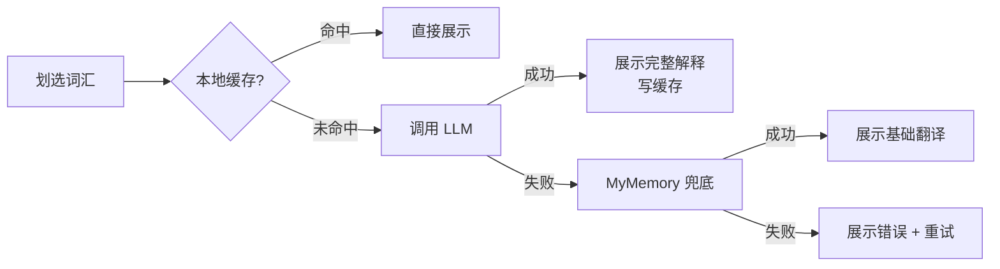

# ReflectPDF — 产品需求文档 (PRD)

**版本**: v1.0 (MVP) · **日期**: 2026-03-22

---

## 1. 产品定位

为深度学习者设计的智能 PDF 阅读工具。像 macOS 预览一样流畅，但支持**上下文感知翻译**和**知识永久沉淀**。

---

## 2. 核心痛点

| 痛点 | 现有工具的问题 |
|------|--------------|
| 翻译没有语境 | 只给词典释义，无法解释"为什么在这个句子里是这个意思" |
| 查完即忘 | 无法便捷保存词汇 + 句子 + 解释三元组，也无法在 PDF 留下痕迹 |
| 选词不准确 | pdf.js 方案坐标计算误差大，严重影响体验 |

---

## 3. 功能需求（MVP）

### F1 — PDF 阅读

- **文库侧边栏**：展示所有曾打开的 PDF（按最近打开倒序），每条显示文件名、阅读进度（P32/118）。支持拖入文件或通过文件选择器打开；支持右键从文库移除（不删磁盘文件）。
- **阅读位置恢复**：关闭 / 切换 / App 后台时自动保存当前页码和页内滚动偏移；重新打开时自动跳转，并用 Toast 提示"已定位到 P32"。
- **PDF 渲染**：基于 PDFKit，支持缩放（25%–400%）、连续滚动；已保存词汇显示黄色高亮 Annotation，点击直接展示缓存解释，不调用 LLM。

### F2 — 智能划词翻译（核心）

划选词汇后，自动提取所在完整句子（最长 500 字符），调用后端翻译，弹出气泡。

**翻译优先级**：本地缓存（< 50ms）→ LLM（OpenAI 兼容接口）→ MyMemory 免费 API（兜底）

气泡展示：词汇 + 音标 + 词性 + 上下文句子 + **语境解释**（LLM 专属）+ 发音按钮 + 保存按钮。兜底翻译无语境解释，显示"基础翻译"徽标。

**LLM 返回格式（JSON）**：`word` / `phonetic` / `part_of_speech` / `context_translation` / `context_explanation` / `general_definition`

### F3 — 单词本与发音

- 点击"保存"：写入 SQLite + 在 PDF 原文添加黄色高亮 Annotation，< 200ms 完成。
- 单词本侧边栏：展示词汇、音标、句子摘要、来源 PDF 及页码；点击可跳转定位。
- 🔊 发音：使用 `AVSpeechSynthesizer`（系统本地 TTS），零延迟、离线可用。

### F4 — 设置

LLM API Base URL + API Key（存 Keychain）+ 模型名称（默认 `gpt-4o-mini`）+ 目标翻译语言（默认简体中文）。

---

## 4. 非功能需求

| 指标 | 目标 |
|------|------|
| 阅读位置恢复 | < 1.5 秒 |
| 划词到气泡（缓存命中） | < 100 ms |
| 保存到单词本 | < 200 ms |
| 发音播放 | < 50 ms |

- **隐私**：所有数据本地存储；API Key 存 Keychain；发送给 LLM 的内容仅为选中词 + 所在句子。
- **兼容性**：macOS 13+，支持 Apple Silicon 和 Intel。

---

## 5. 核心流程

### 划词翻译

### App 启动 / 打开 PDF

---

## 6. 数据模型（关键字段）

**`pdf_documents`**：`file_path`（唯一）、`total_pages`、`last_page`、`last_scroll_offset`、`opened_at`、`added_at`

**`vocabulary_entries`**：`word`、`sentence`、`sentence_hash`、`pdf_path`、`page_index`、`selection_bounds`、`phonetic`、`context_explanation`、`translation_source`、`annotation_id`

**`translation_cache`**：`word`、`sentence_hash`（联合唯一索引）、`response_json`、`source`
