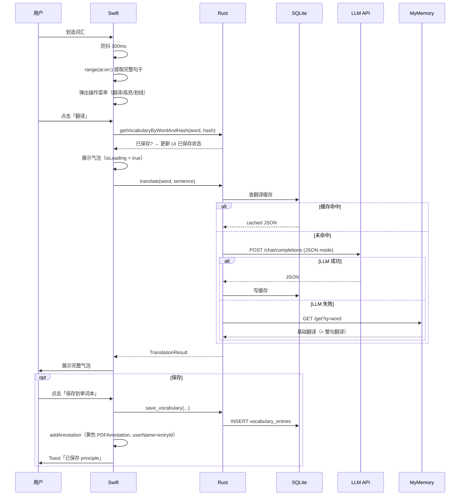

# LumenPDF — 技术实现文档 (TDD)

**版本**: v1.1 · **日期**: 2026-03-22

---

## 1. 技术架构

### 整体分层

```
Swift UI (PDFKit)
    │
    │  UniFFI 自动生成绑定（lumen_pdf_core.swift）
    ▼
Rust interfaces/api.rs  ← #[uniffi::export]
    │
    ├── application/
    │      TranslationUseCase
    │      VocabularyUseCase
    │      PdfDocumentUseCase
    │
    ├── domain/                  ← 无任何外部 I/O 依赖
    │      entity + Repository Traits
    │      TranslationDomainService（三级降级）
    │
    └── infrastructure/
           SQLite Repos（rusqlite + r2d2）
           LlmTranslator（reqwest）
           FallbackTranslator（MyMemory）
```

### 层间职责

| 层             | 职责                                               | 禁止                  |
| -------------- | -------------------------------------------------- | --------------------- |
| Swift UI       | PDF 渲染、事件处理、句子提取、Annotation 绘制、TTS | 网络请求、直接操作 DB |
| UniFFI         | 类型转换、跨语言调用转发                           | 任何业务逻辑          |
| interfaces     | UniFFI 导出 + 依赖注入                             | 业务逻辑              |
| application    | 用例编排                                           | 直接操作 DB 或 HTTP   |
| domain         | 实体定义、Repository trait、翻译策略               | 依赖任何外部 I/O      |
| infrastructure | 实现 domain 定义的 trait                           | 包含业务规则          |

---

## 2. 技术选型

| 组件     | 选型                     | 理由                                  |
| -------- | ------------------------ | ------------------------------------- |
| UI       | SwiftUI + PDFKit         | 原生 PDF 引擎，选词精准，GPU 渲染     |
| 发音     | AVSpeechSynthesizer      | 本地 TTS，零延迟，离线可用            |
| FFI      | Mozilla UniFFI           | 自动生成 Swift 绑定，类型安全         |
| 后端     | Rust + Tokio             | 内存安全，高性能异步                  |
| DB       | SQLite (rusqlite + r2d2) | 嵌入式，WAL 模式，无部署成本          |
| HTTP     | reqwest                  | 异步，支持 OpenAI 兼容接口            |
| 兜底翻译 | MyMemory REST API        | 完全免费，无需注册                    |
| 拖拽     | AppKit `mouseDragged`    | 绕过 SwiftUI 手势管线，实现帧同步拖拽 |
| 文件访问 | Security-Scoped Bookmark | 沙盒下跨重启持久访问用户文件          |

---

## 3. 项目目录结构

```
lumen-pdf/
├── LumenPDF/                             # Swift / Xcode 工程
│   ├── App/
│   │   ├── AppState.swift                  # 全局可观察状态
│   │   └── LumenPDFApp.swift
│   ├── Views/
│   │   ├── ContentView.swift               # NavigationSplitView 主布局
│   │   ├── PDFReaderView.swift             # PDFKitView + Coordinator
│   │   ├── PDFOutlineSidebarView.swift     # TOC 目录侧栏
│   │   ├── TranslationBubble.swift         # 翻译气泡（可拖动）
│   │   ├── VocabularyListView.swift        # 单词本（按词分组）
│   │   ├── LibrarySidebarView.swift        # 文库 Popover
│   │   ├── ContextSentenceFormatting.swift # PDF 换行规范化工具
│   │   └── SettingsView.swift
│   ├── Services/
│   │   ├── BridgeService.swift             # UniFFI 调用封装
│   │   ├── ReadingSessionService.swift     # sentence hash 计算
│   │   ├── AudioService.swift              # AVSpeechSynthesizer 封装
│   │   └── KeychainService.swift
│   ├── Generated/                          # UniFFI 自动生成，勿手改
│   │   ├── lumen_pdf_core.swift
│   │   ├── lumen_pdf_coreFFI.h
│   │   ├── lumen_pdf_coreFFI.modulemap
│   │   └── liblumen_pdf_core.dylib
│   ├── project.yml                         # xcodegen 配置
│   ├── Info.plist
│   └── LumenPDF.entitlements
│
├── lumen-pdf-core/                       # Rust crate
│   └── src/
│       ├── interfaces/api.rs               # #[uniffi::export]，全局单例 Pool/Config
│       ├── application/
│       │   ├── translation/use_case.rs
│       │   ├── vocabulary/use_case.rs
│       │   └── pdf_document/use_case.rs
│       ├── domain/
│       │   ├── translation/               # entity / repository / service（三级降级）
│       │   ├── vocabulary/               # entity / repository
│       │   └── pdf_document/             # entity / repository
│       ├── infrastructure/
│       │   ├── db/
│       │   │   ├── migration.rs          # 建表 + ALTER 迁移
│       │   │   ├── vocabulary_repo.rs
│       │   │   ├── pdf_document_repo.rs
│       │   │   └── translation_cache_repo.rs
│       │   └── translator/
│       │       ├── llm_translator.rs     # OpenAI 兼容接口
│       │       └── fallback_translator.rs # MyMemory API
│       └── error.rs
│
├── scripts/build-rust.sh                  # Rust 构建 + UniFFI 生成
├── Makefile
└── docs/
    ├── prd/prd-2026-03-22.md
    ├── tdd/tdd-2026-03-22.md
    └── instruction.md
```

---

## 4. 关键设计决策

### 4.1 翻译策略（TranslationDomainService）

```
translate(word, sentence)
    │
    ├─ 查 SQLite 缓存  key = (LOWER(word), SHA256(sentence))
    │       ├─ 命中 → source=cache，返回
    │       └─ 未命中 ↓
    ├─ LlmTranslator.translate(word, sentence)
    │       ├─ 成功 → 写缓存，source=llm，返回
    │       └─ 失败 ↓
    └─ FallbackTranslator.translate(word, sentence)
            └─ source=fallback（不写缓存，下次重试 LLM）
```

> Swift 侧**不复用旧缓存结果**：每次选词都调用 Rust `translate()`，让 Rust 侧决定是否命中缓存。`getVocabularyByWordAndHash` 只用于判断该条目是否已保存（控制「已保存」状态），不跳过翻译。

### 4.2 LLM JSON 格式

```json
{
  "word": "principle",
  "phonetic": "/ˈprɪnsɪpəl/",
  "part_of_speech": "noun",
  "context_translation": "在此语境下该词的翻译",
  "context_explanation": "为何在此处有这个含义的解释（目标语言）",
  "general_definition": "General English definition of the word",
  "context_sentence_translation": "整句话翻译到目标语言"
}
```

`#[serde(default)]` 保证缺失字段不导致反序列化失败（兼容旧缓存）。

### 4.3 PDF 句子提取（`extractFullSentence`）

1. 用 `selection.range(at: 0, on: page)` 取选区在 `page.string` 中的 **UTF-16 字符范围**（而非几何坐标），避免 `characterIndex(at:)` 坐标错位的问题。
2. 以选区中点为 anchor，在 `NSString` UTF-16 数组中向左/右扫描，**只在 `.!?。！？` 处截断**（不在 `;:` 或换行处截断），保留完整语义句。
3. `ContextSentenceFormatting.displayParagraph(_:)` 在展示时将 PDF 排版换行（`\n`、连续空白）合并为连贯段落。

### 4.4 PDF 高亮分类（`PDFAnnotation.userName`）

| 来源     | `userName`    | 颜色            |
| -------- | ------------- | --------------- |
| 保存单词 | 词汇条目 UUID | 黄色 0.5 透明度 |
| 自由高亮 | `"__fh"`      | 黄色 0.5 透明度 |
| 自由划线 | `"__fu"`      | 蓝色 0.6 透明度 |

Toggle 逻辑：查找 `userName == tag` 且 `bounds.intersects(selection.bounds)` 的注释：

- 无重叠 → 添加
- 完全覆盖选区 → 移除（toggle off）
- 部分覆盖 → `existing.reduce(selectionBounds) { $0.union($1.bounds) }` 合并后重建

### 4.5 阅读位置持久化

- **保存时机**：PDFView `PDFViewPageChanged` 通知（防抖策略在 AppState 层），写 `last_page` + `last_scroll_offset`（页内归一化 0.0–1.0，`documentVisibleRect.minY / documentView.bounds.height`）
- **恢复时机**：`updateNSView` 检测到文档切换后 `DispatchQueue.main.async` 调用 `pdfView.go(to:)`
- **Security-Scoped Bookmark**：`openPDF(url:)` 时调用 `url.bookmarkData(options: .withSecurityScope)`，存入 `UserDefaults["bm_<filePath>"]`；`loadDocument(filePath:)` 直接访问失败时通过 `URL(resolvingBookmarkData:options:.withSecurityScope)` + `startAccessingSecurityScopedResource()` 重新授权

### 4.6 TOC 侧栏

`PDFOutlineSidebarView` 递归渲染 `document.outlineRoot`：

- `activePageIndex`：遍历 outline 找到 `pageIndex <= currentPageIndex` 最大值
- 用 `ScrollViewReader` + `.id(myPageIndex)` 在 `activePageIndex` 变化时滚动到当前章节
- 点击条目发 `Notification.Name.outlineNavigate`，`Coordinator` 收到后调用 `pdfView.go(to:)`

### 4.7 翻译气泡拖拽（AppKit 级别）

SwiftUI `DragGesture` 经过手势识别管线延迟可感知，改用 `NSViewRepresentable`（`AppKitDragCapture`）：

- `mouseDown` 记录起点
- `mouseDragged` 计算增量 `delta`（注意 AppKit Y 轴向上，需取反适配 SwiftUI）
- 直接更新 `@State var offset: CGSize`，配合 `.animation(nil, value: offset)` 阻止任何隐式动画

---

## 5. 数据库表结构（当前版本）

```sql
CREATE TABLE vocabulary_entries (
    id                            TEXT PRIMARY KEY,
    word                          TEXT NOT NULL,
    sentence                      TEXT NOT NULL,
    sentence_hash                 TEXT NOT NULL,
    pdf_path                      TEXT NOT NULL,
    pdf_name                      TEXT NOT NULL,
    page_index                    INTEGER NOT NULL,
    selection_bounds              TEXT NOT NULL DEFAULT '',
    phonetic                      TEXT NOT NULL DEFAULT '',
    part_of_speech                TEXT NOT NULL DEFAULT '',
    context_translation           TEXT NOT NULL DEFAULT '',
    context_explanation           TEXT NOT NULL DEFAULT '',
    general_definition            TEXT NOT NULL DEFAULT '',
    context_sentence_translation  TEXT NOT NULL DEFAULT '',   -- v1.1 新增
    translation_source            TEXT NOT NULL DEFAULT '',
    annotation_id                 TEXT,
    created_at                    INTEGER NOT NULL,
    query_count                   INTEGER NOT NULL DEFAULT 0  -- v1.1 新增
);

CREATE TABLE translation_cache (
    id            TEXT PRIMARY KEY,
    word          TEXT NOT NULL,
    sentence_hash TEXT NOT NULL,
    response_json TEXT NOT NULL,   -- JSON，TranslationResult（serde）
    source        TEXT NOT NULL DEFAULT 'llm',
    created_at    INTEGER NOT NULL,
    hit_count     INTEGER NOT NULL DEFAULT 0,
    UNIQUE(word, sentence_hash)
);

CREATE TABLE pdf_documents (
    id                 TEXT PRIMARY KEY,
    file_path          TEXT NOT NULL UNIQUE,
    file_name          TEXT NOT NULL,
    total_pages        INTEGER NOT NULL DEFAULT 0,
    last_page          INTEGER NOT NULL DEFAULT 0,
    last_scroll_offset REAL    NOT NULL DEFAULT 0.0,
    opened_at          INTEGER NOT NULL,
    added_at           INTEGER NOT NULL
);
```

**迁移策略**：`ALTER TABLE ... ADD COLUMN ... DEFAULT ''` 包裹在 `let _ =` 里忽略错误，兼容已有数据库。

---

## 6. UniFFI 导出 API 一览

| 函数                                          | 类型  | 说明                                        |
| --------------------------------------------- | ----- | ------------------------------------------- |
| `initialize(db_path, config)`                 | sync  | App 启动时调用一次，初始化连接池 + LLM 配置 |
| `translate(request)`                          | async | 三级降级翻译                                |
| `save_vocabulary(req)`                        | sync  | 保存词汇条目                                |
| `get_vocabulary_by_word_and_hash(word, hash)` | sync  | 查是否已保存                                |
| `list_vocabulary()`                           | sync  | 全量词汇（Swift 侧在内存过滤/分组）         |
| `delete_vocabulary(id)`                       | sync  | 删除条目                                    |
| `update_vocabulary(req)`                      | sync  | 编辑条目内容                                |
| `increment_vocabulary_query_count(id)`        | sync  | 查询计数 +1                                 |
| `upsert_pdf_document(req)`                    | sync  | 插入或更新 PDF 记录                         |
| `save_reading_position(path, page, offset)`   | sync  | 保存阅读位置                                |
| `list_pdf_documents()`                        | sync  | 文库列表                                    |
| `delete_pdf_document(path)`                   | sync  | 从文库移除                                  |

---

## 7. 关键时序

### 划词翻译完整流程



---

## 8. 构建流程

### 开发构建

```bash
# 1. 构建 Rust dylib + 生成 UniFFI Swift 绑定
./scripts/build-rust.sh

# 2. 在 Xcode 打开工程编译运行
open LumenPDF/LumenPDF.xcodeproj
```

### 快捷命令（Makefile）

```bash
make build-rust      # 等同 ./scripts/build-rust.sh
make test            # cargo test --lib
make gen-project     # xcodegen generate（project.yml 变更时）
```

### build-rust.sh 流程

1. 检测当前架构（`uname -m`），选 `aarch64-apple-darwin` 或 `x86_64-apple-darwin`
2. `cargo build --target $TARGET`
3. `cargo run --bin uniffi-bindgen generate --library $DYLIB --language swift --out-dir Generated/`
4. 复制 `.dylib` 到 `Generated/`

### 发布（Universal Binary）

```bash
cargo build --release --target aarch64-apple-darwin
cargo build --release --target x86_64-apple-darwin
lipo -create \
    target/aarch64-apple-darwin/release/liblumen_pdf_core.dylib \
    target/x86_64-apple-darwin/release/liblumen_pdf_core.dylib \
    -output LumenPDF/Generated/liblumen_pdf_core.dylib
```

---

## 9. 测试策略

| 层             | 测试方式                                       |
| -------------- | ---------------------------------------------- |
| domain         | Rust `#[tokio::test]`，Mock Translator + Cache |
| infrastructure | Rust 集成测试，使用临时内存 SQLite             |
| Swift UI       | 手动测试 + Xcode Previews                      |

当前已有测试：

- `cache_hit_skips_llm`：缓存命中不调用 LLM
- `successful_llm_result_is_cached`：LLM 成功后写缓存
- `llm_failure_falls_back_and_does_not_cache`：兜底结果不写缓存
- `scroll_offset_within/out_of_range_*`：滚动偏移边界验证
