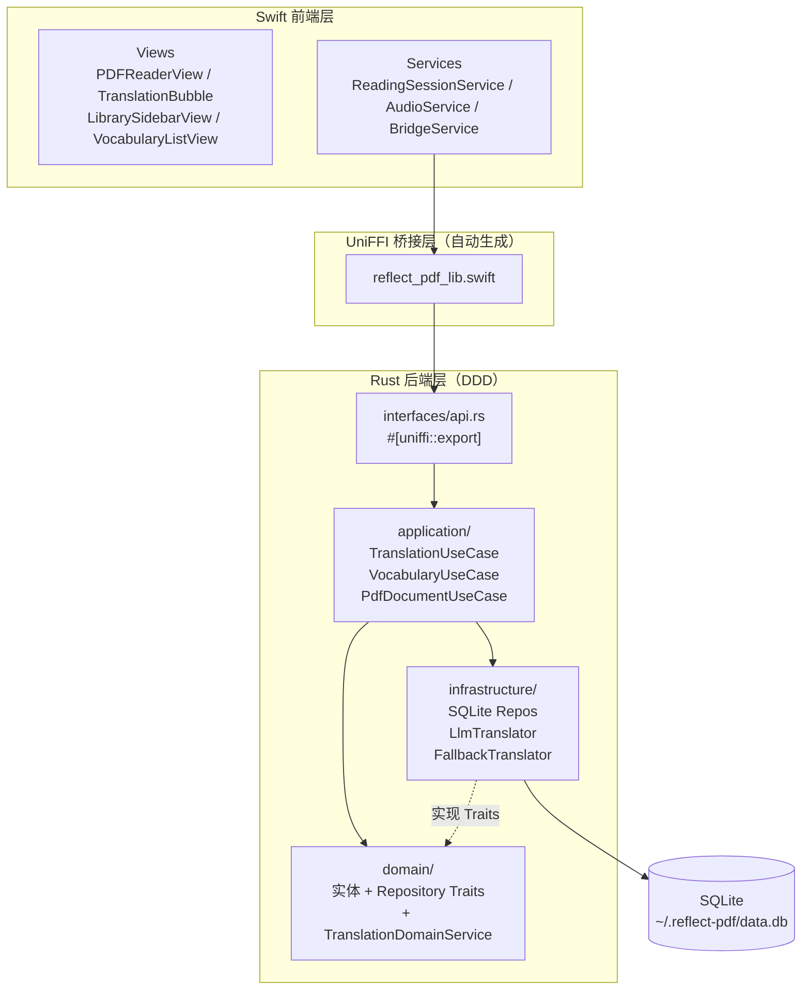
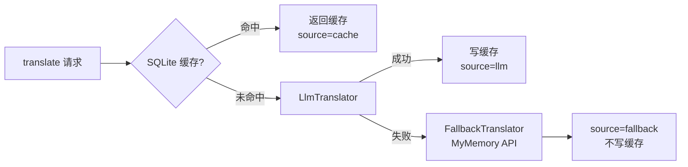
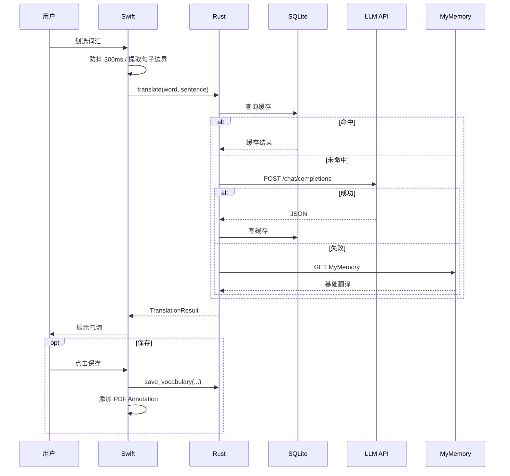
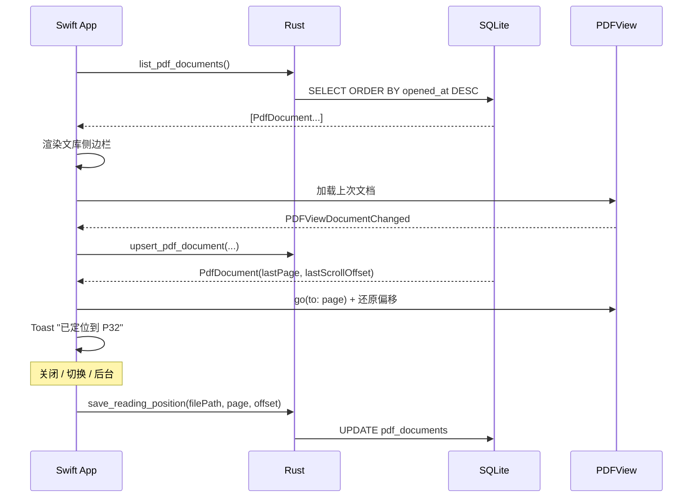

# ReflectPDF — 技术实现文档 (TDD)

**版本**: v1.0 (MVP) · **日期**: 2026-03-22

---

## 1. 技术架构

### 整体分层



### 层间职责

| 层 | 职责 | 禁止 |
|----|------|------|
| Swift UI | PDF 渲染、用户事件、句子提取、Annotation 绘制、本地 TTS | 网络请求、直接操作 DB |
| UniFFI | 类型转换、跨语言调用转发 | 任何业务逻辑 |
| interfaces | UniFFI 导出 + 依赖注入 | 业务逻辑 |
| application | 用例编排 | 直接操作 DB 或 HTTP |
| domain | 实体定义、Repository trait、翻译策略 | 依赖任何外部库 |
| infrastructure | 实现 domain 定义的 trait | 包含业务规则 |

---

## 2. 技术选型

| 组件 | 选型 | 理由 |
|------|------|------|
| UI | SwiftUI + PDFKit | 原生 PDF 引擎，选词精准，GPU 渲染 |
| 发音 | AVSpeechSynthesizer | 本地 TTS，零延迟，离线可用 |
| FFI | Mozilla UniFFI | 自动生成 Swift 绑定，类型安全 |
| 后端 | Rust + Tokio | 内存安全，高性能异步 |
| DB | SQLite (rusqlite + r2d2) | 嵌入式，WAL 模式，无部署成本 |
| HTTP | reqwest | 异步，支持 OpenAI 兼容接口 |
| 兜底翻译 | MyMemory REST API | 完全免费，无需注册 |

---

## 3. 项目目录结构

```
reflect-pdf/
├── ReflectPDF/                       # Swift / Xcode
│   ├── App/
│   ├── Views/
│   │   ├── LibrarySidebarView.swift
│   │   ├── PDFReaderView.swift
│   │   ├── TranslationBubble.swift
│   │   ├── VocabularyListView.swift
│   │   └── SettingsView.swift
│   ├── Services/
│   │   ├── BridgeService.swift       # UniFFI 调用封装
│   │   ├── ReadingSessionService.swift
│   │   └── AudioService.swift
│   └── Generated/                    # UniFFI 自动生成，勿手改
│
├── reflect-pdf-core/                 # Rust crate
│   └── src/
│       ├── interfaces/api.rs         # #[uniffi::export]
│       ├── application/
│       │   ├── translation/
│       │   ├── vocabulary/
│       │   └── pdf_document/
│       ├── domain/
│       │   ├── translation/          # entity / repository / service
│       │   ├── vocabulary/           # entity / repository
│       │   └── pdf_document/         # entity / repository
│       └── infrastructure/
│           ├── db/                   # SQLite repo 实现 + migrations
│           └── translator/           # LlmTranslator / FallbackTranslator
│
└── scripts/build-rust.sh
```

---

## 4. 关键设计决策

### 4.1 翻译策略（TranslationDomainService）

三级降级，对上层调用方完全透明：



- LLM 成功才写缓存，兜底结果不缓存（下次重试 LLM）
- `source` 字段透传到 Swift，UI 据此决定是否展示语境解释区域

### 4.2 阅读位置持久化

- **保存时机**：窗口关闭 / 切换文档 / App 进入后台，写 `last_page` + `last_scroll_offset`（页内归一化 0.0–1.0）
- **恢复时机**：PDFKit 文档加载完成后（`PDFViewDocumentChanged`），Swift 侧读取记录并调用 `pdfView.go(to:)` 恢复位置，展示 Toast
- **删除语义**：从文库移除只删 `pdf_documents` 行，`vocabulary_entries` 保留

### 4.3 PDF 高亮与缓存关联

- 保存单词时，在 PDFKit Annotation 的自定义属性中存储 `entry_id`
- 点击已高亮词汇时，从 Annotation 读取 `entry_id`，直接查 SQLite，**不调用 LLM**
- 缓存 key：`(LOWER(word), SHA256(sentence))`，同词同句只调用一次 LLM

### 4.4 UniFFI 桥接

UDL 定义的核心 API 分三组：

| 组 | API |
|----|-----|
| 翻译 | `translate(request)` async |
| 单词本 | `save_vocabulary` / `get_vocabulary_entry` / `list_vocabulary` / `delete_vocabulary` |
| 文库 | `upsert_pdf_document` / `save_reading_position` / `list_pdf_documents` / `delete_pdf_document` |

---

## 5. 数据库表结构

```sql
-- 词汇条目
vocabulary_entries (id, word, sentence, sentence_hash, pdf_path, pdf_name,
    page_index, selection_bounds, phonetic, part_of_speech,
    context_translation, context_explanation, general_definition,
    translation_source, annotation_id, created_at)

-- 翻译缓存（UNIQUE: word + sentence_hash）
translation_cache (id, word, sentence_hash, response_json, source, created_at, hit_count)

-- PDF 文库 & 阅读位置
pdf_documents (id, file_path UNIQUE, file_name, total_pages,
    last_page, last_scroll_offset, opened_at, added_at)
```

所有表启用 `PRAGMA journal_mode=WAL` 提升并发写性能。

---

## 6. 关键时序

### 划词翻译



### App 启动 & 阅读位置恢复



---

## 7. 构建流程

```bash
# 构建 Rust + 生成 Swift 绑定
./scripts/build-rust.sh

# 发布：Universal Binary
cargo build --release --target aarch64-apple-darwin
cargo build --release --target x86_64-apple-darwin
lipo -create ...两个 dylib... -output libreflect_pdf_core.dylib
```

Xcode 集成：将 `Generated/` 加入项目 → Link `libreflect_pdf_core.dylib` → Run Script 调用构建脚本。
